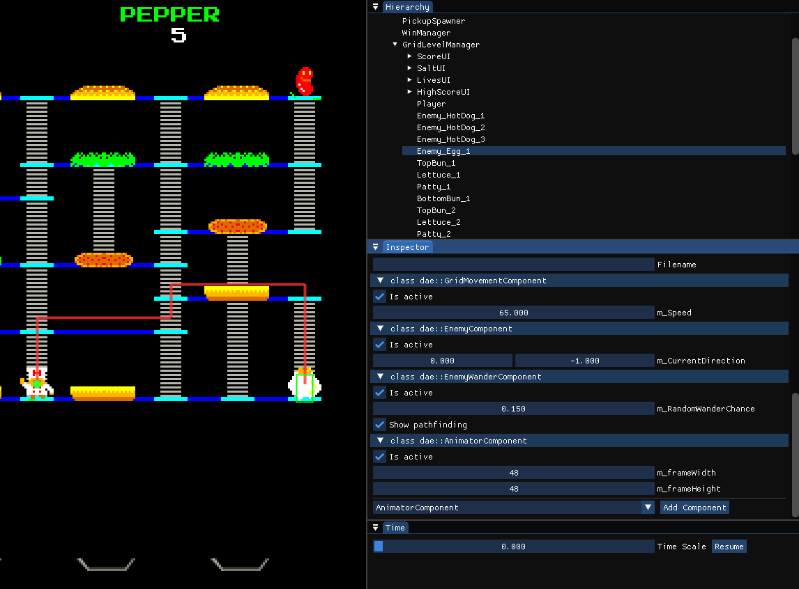
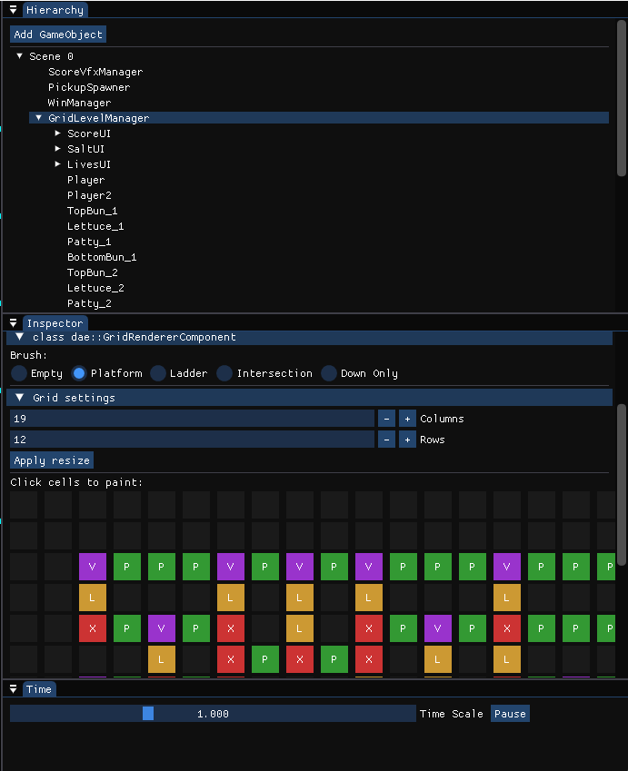
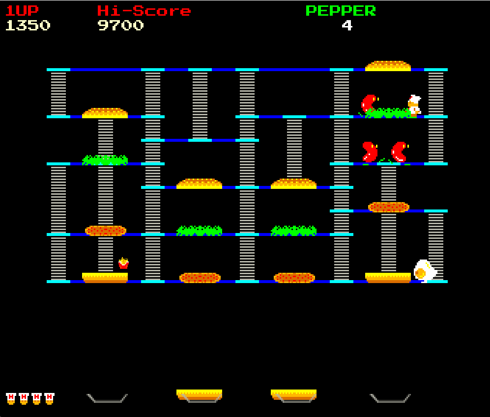
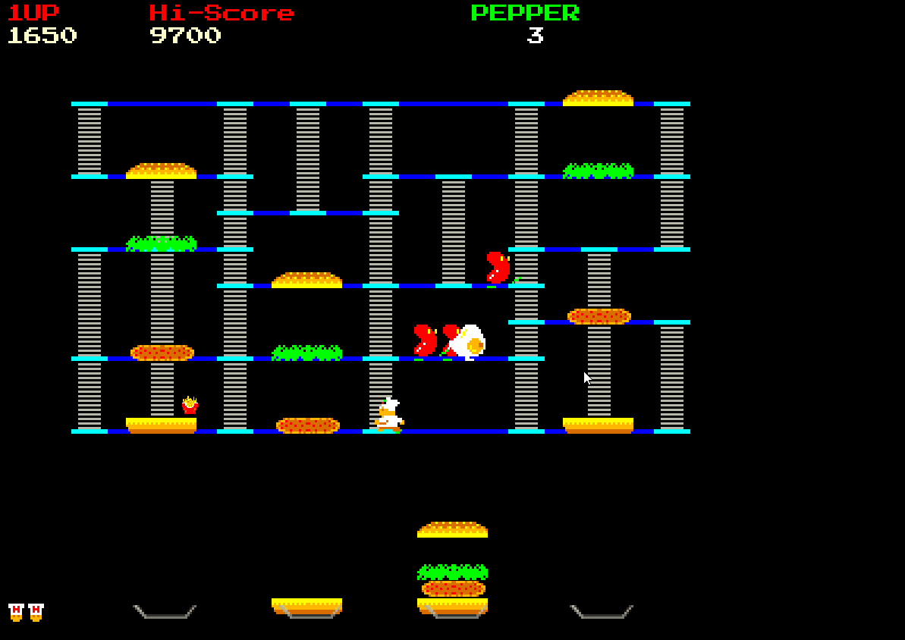
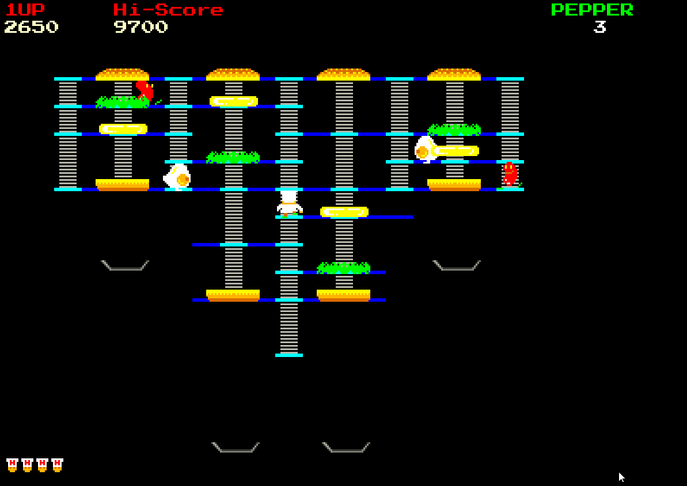
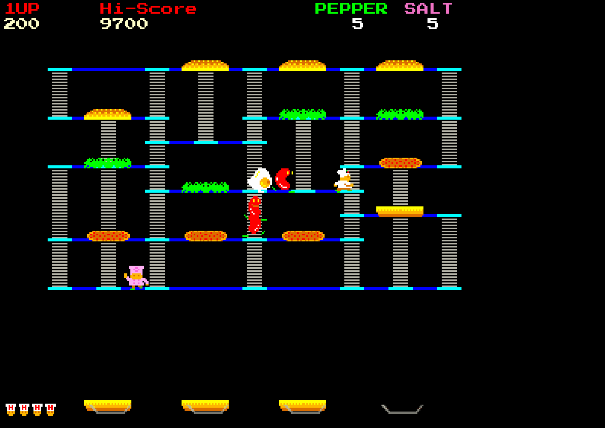
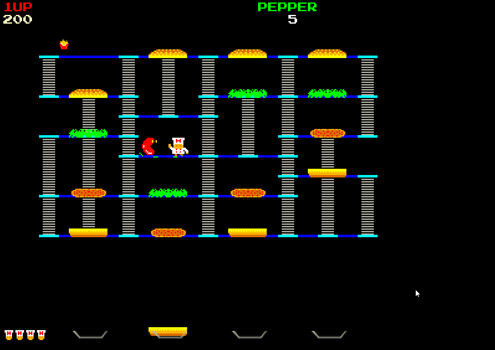
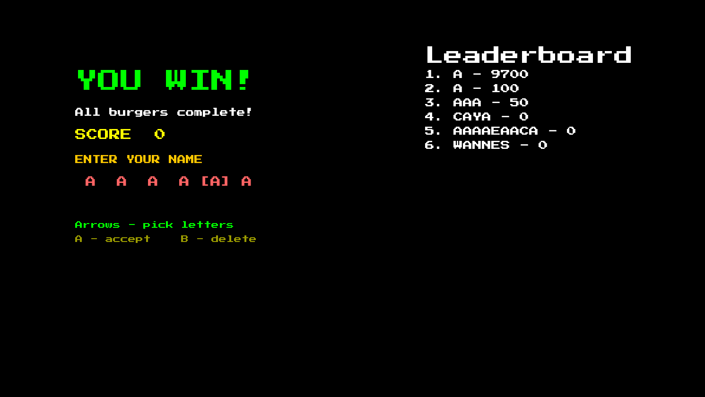

# Engine & Burger Time

This repository contains a custom 2D component-based game engine written in C++, and a recreation of the classic 1982 arcade game **Burger Time** built on top of it.

This project was developed as part of the Programming 4 assignment at Howest Digital Arts and Entertainment (DAE) by Wannes De Tollenaere.

## Source Control

The project is version-controlled with Git and hosted on GitHub:

**https://github.com/WannesDeTollenaere/2DAE19_DeTollenaere_Wannes_Programming4**

## Web

Play the game in your web browser [here](https://wannesdetollenaere.github.io/2DAE19_DeTollenaere_Wannes_Programming4/)


## Engine Features

The engine is a 2D game engine built with modern C++ and SDL3. It is designed around flexibility and a data-driven architecture.

* **Component-Based Architecture:** Game objects are purely structural containers. Behavior and rendering are defined by attaching specific modular components (`TextureComponent`, `AnimatorComponent`, `RotatorComponent`, `TextComponent`, etc.).
* **Data-Driven Scene Loading:** Levels and scenes are completely constructed via JSON files using the `nlohmann/json` library, allowing for rapid level design and tweaking without needing to recompile C++ code. Supports hierarchical parent-child relationships natively.

## Engine Specifics & Design Choices

The engine leans heavily on classic design patterns to keep gameplay code decoupled from engine systems. The guiding principle throughout was **data-driven design**: as much as possible should be expressible in JSON so that levels, prefabs and UI can be authored and tweaked without recompiling.

* **GameObject / Component model:** A `GameObject` is a lightweight container that owns a `Transform` and a list of components.
* **Data-driven component registry:** Components register themselves with a parser via a `REGISTER_COMPONENT_PARSER` macro. The `SceneLoader` reads a scene's JSON, looks up each component by its `"type"` string, and constructs it. Adding a new component to a scene is therefore just a code registration plus a JSON entry, no central switch statement to maintain.

```cpp
// Minigin/SceneLoader.h
class IComponentParser {
public:
    virtual ~IComponentParser() = default;
    virtual void Parse(GameObject* go, const nlohmann::json& data) = 0;
};

// a generic parser for components that don't need json data
template <typename T>
class SimpleParser final : public IComponentParser {
public:
    void Parse(GameObject* go, const nlohmann::json&) override {
        go->AddComponent<T>();
    }
};

// A component registers itself once, at static-init time, via this macro.
#define REGISTER_COMPONENT_PARSER(Type, ParserClass) \
    static struct Type##Registrar { \
        Type##Registrar() { \
            dae::SceneLoader::RegisterComponentParser(#Type, std::make_unique<ParserClass>()); \
        } \
    } Type##RegistrarInstance;
```

```cpp
// Minigin/SceneLoader.cpp - components are constructed by their JSON "type" string,
// so there is no central switch statement to maintain.
for (const auto& compData : objData["components"])
{
    std::string type = compData.value("type", "");
    auto& parsers = GetParsersMap();

    auto it = parsers.find(type);
    if (it != parsers.end())
    {
        it->second->Parse(pGameObject, compData);
    }
    else
    {
        std::cerr << "Warning: Unknown component type: " << type << "\n";
    }
}
```

* **Prefab system:** Reusable object hierarchies (UI panels, leaderboards, etc.) are defined once as prefab JSON files and instantiated by reference from scenes, avoiding duplication.
* **Property exposure for tooling:** Components can expose their fields to the Dear ImGui debug UI via an `EXPOSE` macro, allowing live inspection and tweaking of values at runtime.

  

* **Service Locator for audio:** The sound system is accessed through a `ServiceLocator` rather than a hard dependency. It ships with a `NullSoundSystem` (null-object pattern, so no null checks are needed at call sites), an `SdlSoundSystem` for real playback, and a `LoggingSoundSystem` decorator that wraps another system to log calls in debug builds.

```cpp
// Minigin/Sound/ServiceLocator.h
class ServiceLocator final
{
    inline static std::unique_ptr<SoundSystem> m_SsInstance;
public:
    static SoundSystem& GetSoundSystem() { return *m_SsInstance; }
    static void RegisterSoundSystem(std::unique_ptr<SoundSystem>&& ss) {
        m_SsInstance = ss == nullptr ? std::make_unique<NullSoundSystem>() : std::move(ss);
    }
};
```

* **Observer pattern / Event system:** An `EventManager` dispatches strongly-typed events (e.g. `ScoreChangedEvent`) identified by compile-time SDBM string hashes. Systems like the score and high-score displays subscribe to these events instead of polling, keeping them decoupled from gameplay logic.

```cpp
// Minigin/ObserverSys/EventManager.h
class EventManager final : public Singleton<EventManager>
{
public:
    void AttachEvent(EventId id, Observer* handler)
    {
        m_observers[id].push_back(handler);
    }

    void DetachEvent(EventId id, Observer* handler)
    {
        auto it = m_observers.find(id);
        if (it != m_observers.end())
        {
            std::erase(it->second, handler);
        }
    }

    void SendEvent(const Event* pEvent)
    {
        auto observerList = m_observers[pEvent->id];
        for (auto observer : observerList)
        {
            observer->HandleEvent(pEvent);
        }
    }

private:
    friend class Singleton<EventManager>;
    EventManager() = default;

    std::unordered_map<EventId, std::vector<Observer*>> m_observers;
};
```

* **Command pattern for input:** The `InputManager` binds keyboard scancodes and controller buttons to `Command` objects, with separate up/down/pressed states. This makes input fully remappable and lets the same command be triggered by keyboard or gamepad.

```cpp
// Minigin/InputManager.h
void BindCommand(uint16_t controllerIndex, Gamepad::ControllerButton button,
                 InputState state, std::unique_ptr<Command> command);
void BindKeyboardCommand(SDL_Scancode key, InputState state,
                         std::unique_ptr<Command> command);

// controller or keyboard - the same loop drives both
template <typename InputKeyType>
void ProcessCommandMap(const std::map<InputKeyType, std::unique_ptr<Command>>& commands)
{
    for (const auto& [input, command] : commands)
    {
        if (command && NeedToExecuteCommand(input))
        {
            command->Execute();
        }
    }
}
```

* **State pattern:** Player and enemy behavior is driven by explicit state machines (`PlayerState`, `EnemyState`), keeping per-state logic isolated and transitions readable.
* **Singletons for engine services:** Long-lived managers (`Renderer`, `SceneManager`, `ResourceManager`, `CollisionManager`, `InputManager`, `GameManager`, `GameTime`) are exposed as singletons for convenient global access from anywhere in the codebase.
* **Fixed + variable timestep game loop:** The main loop runs a fixed-timestep update for deterministic gameplay/physics, a variable update for frame-dependent logic, then renders and sleeps to cap the frame rate.

```cpp
// Minigin/Minigin.cpp
void dae::Minigin::RunOneFrame()
{
    GameTime::GetInstance().Tick();

    m_quit = !InputManager::GetInstance().ProcessInput();

    // fixed update
    while (GameTime::GetInstance().ShouldDoFixedUpdate())
    {
        SceneManager::GetInstance().FixedUpdate();
    }

    // normal update
    SceneManager::GetInstance().Update();
    CollisionManager::GetInstance().Update();
    Renderer::GetInstance().Render();

    // sleep if we finished the frame too fast
    SceneManager::GetInstance().HandleLateSceneTransition();
    GameTime::GetInstance().Sleep();
}
```

* **Debug tooling:** Dear ImGui provides an in-engine debug/editor overlay, and Visual Leak Detector is integrated into debug builds on Windows to catch memory leaks. The overlay includes a scene hierarchy, a component inspector, time controls, and a grid-based level editor for painting platforms and ladders.

  

## The Game: Burger Time

The engine powers a functional clone of Data East's **Burger Time**, including single-player, co-op and versus modes, a high-score leaderboard with name entry, pickups, sound effects and music.



### Gameplay

Guide the chef across platforms and ladders, walk over each ingredient to drop it, and assemble the burgers while dodging or stunning the enemies with pepper.

<p>
  
  
</p>

### Game Modes

| Co-op | Versus |
| :---: | :---: |
|  |  |

### High Scores

Finish a run to enter your name and claim a spot on the leaderboard.



## Technologies & Libraries

* **Language:** C++20
* **Graphics/Windowing:** [SDL3](https://github.com/libsdl-org/SDL) & [SDL3_ttf](https://github.com/libsdl-org/SDL_ttf)
* **Audio:** [SDL3_mixer](https://github.com/libsdl-org/SDL_mixer)
* **Math:** [GLM](https://github.com/g-truc/glm)
* **UI/Debugging:** [Dear ImGui](https://github.com/ocornut/imgui)
* **Data Parsing:** [nlohmann/json](https://github.com/nlohmann/json)
* **Build System:** CMake

## How to Build

This project uses CMake. You can build it using the command line or an IDE that supports CMake (like Visual Studio 2022, CLion, or VS Code).

### Prerequisites
* CMake (3.20 or higher)
* A C++20 compatible compiler (MSVC, GCC, Clang)
* Git

### Build Instructions

1. **Clone the repository:**
   ```bash
   git clone https://github.com/WannesDeTollenaere/2DAE19_DeTollenaere_Wannes_Programming4.git
   cd 2DAE19_DeTollenaere_Wannes_Programming4
   ```

2. **Configure the project:**
   ```bash
   cmake -S . -B build
   ```
   Dependencies (SDL3, SDL3_ttf, SDL3_mixer, GLM, Dear ImGui, nlohmann/json) are fetched automatically via CMake's `FetchContent`.

3. **Build:**
   ```bash
   cmake --build build --config Debug
   ```

4. **Run:**
   The build copies the `Data` folder next to the executable, so simply run the generated `game` executable from its build output directory.
